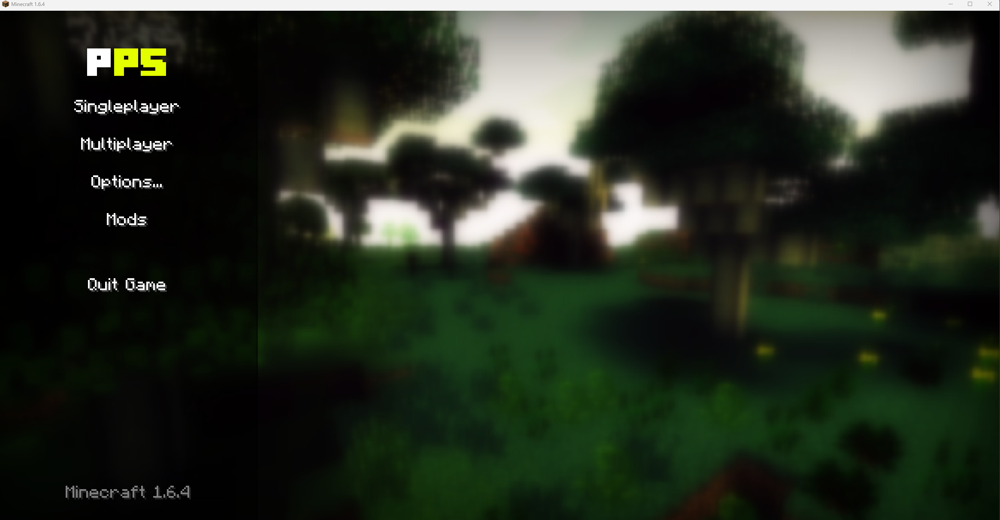
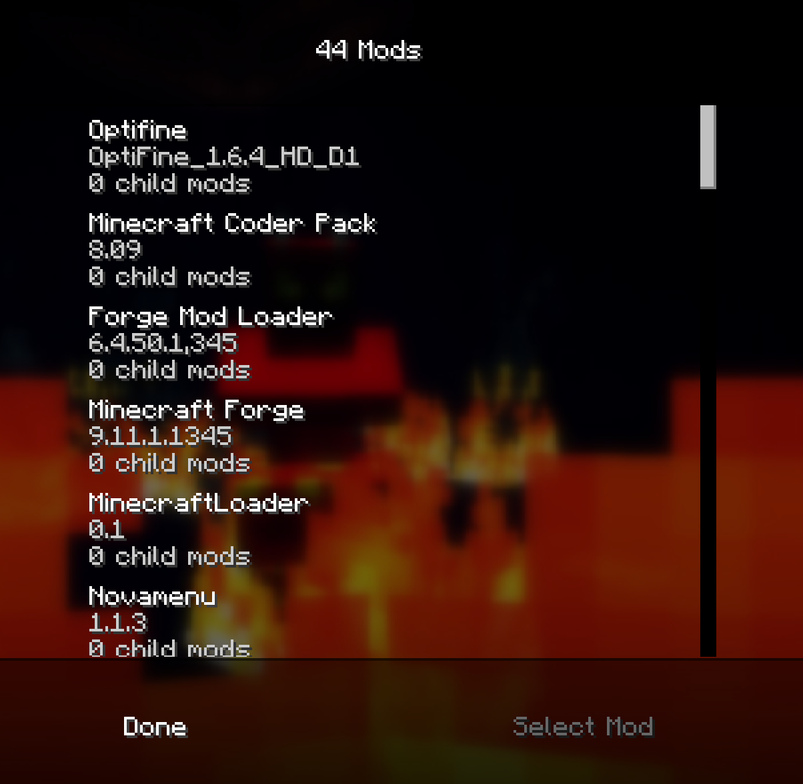
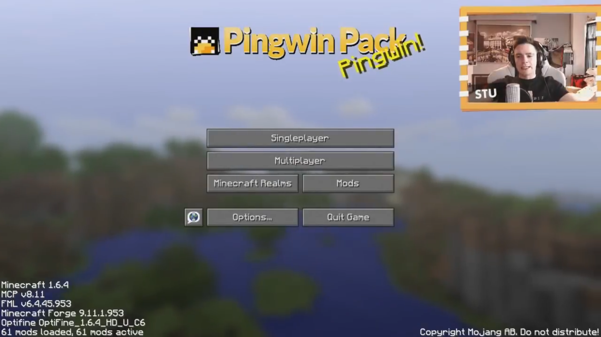

# PP5-Pingwin-Pack-5.0-half
- **PP5 Pingwin Pack 5** jest nie komplety ma tylko **44 mody** (2 zdjęcie) a oryginalna (3 zdjęcie) jest **61 modów** załadowanych.
- Instalator działa ale po zainstalowaniu forge jest uszkodzony.
- Są shadery ale teksturek z filmu nie ma.

# Szybkie wyjaśnienie instalacji

1. Pobieramy **"Pingwin Pack 5.zip"** oraz forge z release, można też pobrać forge z oficjalnej strony link poniżej.
2. Otwieramy **"Pingwin Pack 5.zip"** kopiujemy zawartość .zip do **".minecraft"** i zamieniamy wszystkie pliki (lepiej usunąć folder mods jak się miało wcześniej mody).
3. Instalujemy client **"forge-1.6.4-9.11.1.1345-installer.jar"**.
4. Odpalamy Minecraft Launcher i się cieszymy grą.

# Pobieranie

- **[release](https://github.com/KryskiPL/PP5-Pingwin-Pack-5/releases)**
- **[Forge z oficialnej strony](https://files.minecraftforge.net/net/minecraftforge/forge/index_1.6.4.html)**

# Zrzuty ekranu

- **[Film Stuu](https://youtu.be/ns500w9JZrs)**
